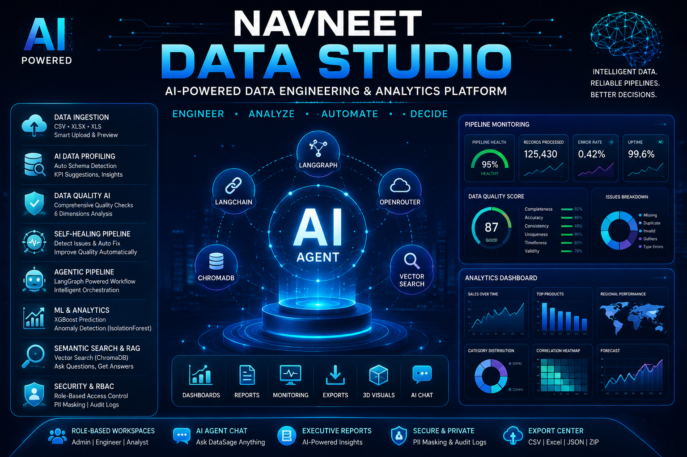
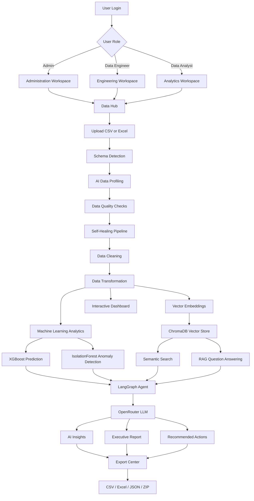
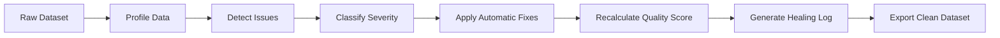
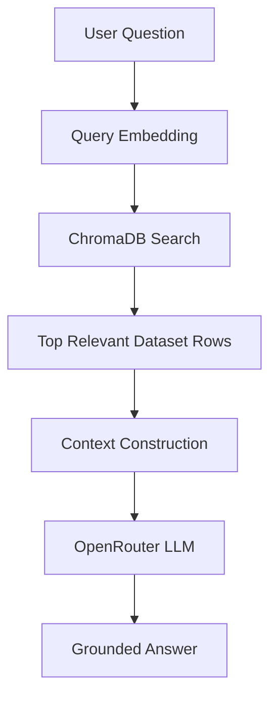

<p align="center">
  
</p>

<div align="center">

# AI Data Studio

### AI-Powered Data Engineering, Analytics and Self-Healing Pipeline Platform


<br>


</div>

---

## Overview

**AI Navneet Data Studio** is a part of my Internship an advanced AI-powered data engineering and analytics platform designed to transform raw business data into clean, reliable and actionable insights.

The platform combines data ingestion, automated profiling, data-quality validation, self-healing pipelines, machine-learning analytics, semantic search, Retrieval-Augmented Generation, pipeline monitoring and executive reporting inside one professional Streamlit application.

It provides separate workspaces for:

- Data Engineers
- Data Analysts
- Administrators
- Business users

The application uses role-based access control to ensure that users only access the tools and information permitted for their assigned roles.

---

## Demo Preview

```text
Add your application screenshot to the GitHub repository as:

Screenshot.png
```

<p align="center">
  
</p>

---

## Core Capabilities

| Capability | Description |
|---|---|
| Data Upload | Upload CSV, XLSX and XLS datasets through the Data Hub |
| Schema Detection | Automatically identifies numeric, categorical, date, text and sensitive columns |
| AI Data Profiling | Generates dataset summaries, business meaning, KPI suggestions and anomaly signals |
| Data Quality Checks | Evaluates missing values, duplicates, invalid formats, inconsistencies and anomalies |
| Self-Healing Pipeline | Automatically detects and repairs common data-quality problems |
| Agentic Pipeline | Uses LangGraph to execute profiling, detection, healing, quality and analytics workflows |
| Data Cleaning | Removes duplicates, fills missing values and standardizes data formats |
| Data Transformation | Creates calculated columns, aggregations and pivot tables |
| Machine Learning | Provides XGBoost prediction and IsolationForest anomaly detection |
| Semantic Search | Uses vector embeddings to retrieve rows based on meaning |
| RAG Question Answering | Answers questions using retrieved dataset evidence |
| Pipeline Monitoring | Tracks pipeline health, errors, processing time, freshness and uptime |
| AI Agent Chat | Allows users to communicate with an intelligent data assistant |
| Executive Reporting | Generates downloadable AI-powered business reports |
| SQLite Storage | Saves users, datasets and application records locally |
| Role-Based Security | Provides separate access for Admin, Data Engineer and Data Analyst |
| PII Masking | Protects sensitive columns from unauthorized users |
| Audit Logging | Records login, upload, cleaning, transformation and download activities |
| Interactive Dashboards | Displays KPIs, trends, correlations, distributions and forecasts |
| 3D Visualizations | Uses Three.js for animated data and network visualizations |
| Export Center | Downloads cleaned CSV, JSON quality reports, Excel workbooks and ZIP files |

---

## System Architecture

```text
                           User
                             │
                             ▼
                 Streamlit Web Application
                             │
                             ▼
                 Authentication and RBAC
                             │
          ┌──────────────────┼──────────────────┐
          │                  │                  │
          ▼                  ▼                  ▼
     Data Engineer      Data Analyst          Admin
       Workspace          Workspace         Workspace
          │                  │                  │
          └──────────────────┼──────────────────┘
                             │
                             ▼
                         Data Hub
                             │
                             ▼
                 CSV / Excel Data Upload
                             │
                             ▼
                   Automatic Schema Detection
                             │
                             ▼
                     AI Data Profiling
                             │
                             ▼
                  Data Quality Validation
                             │
                             ▼
                  Self-Healing Data Pipeline
                             │
                             ▼
                Cleaning and Transformation
                             │
          ┌──────────────────┼──────────────────┐
          │                  │                  │
          ▼                  ▼                  ▼
       XGBoost        IsolationForest       Vector Store
      Prediction        Anomalies           ChromaDB
          │                  │                  │
          └──────────────────┼──────────────────┘
                             │
                             ▼
                   LangGraph Agent Workflow
                             │
                             ▼
                 OpenRouter Reasoning Models
                             │
                             ▼
          Dashboards / RAG / Reports / Exports
                             │
                             ▼
                      SQLite Database
```

---

## Application Workflow



---

## Role-Based Workspaces

### Administrator

The administrator has complete access to the platform.

```text
User Management
Role Management
Audit Logs
Dataset Administration
PII Controls
Security Dashboard
Backup Information
All Engineering Tools
All Analytics Tools
```

### Data Engineer

The Data Engineer workspace focuses on pipeline reliability and data preparation.

```text
Data Upload
Schema Detection
Pipeline Monitoring
Self-Healing Pipeline
Data Quality Checks
Data Cleaning
Data Transformation
Agentic Pipeline
Semantic Search
Engineering Reports
```

### Data Analyst

The Data Analyst workspace focuses on business analysis and reporting.

```text
Business KPIs
Interactive Dashboards
Trend Analysis
Regional Analysis
Product Analysis
Customer Analysis
Forecasting
AI Analytics
Executive Reports
Data Exploration
```

---

## Main Application Pages

| Page | Function |
|---|---|
| Landing Page | Professional project introduction with animated Three.js visuals |
| Developer | Displays developer information and project ownership |
| Data Hub | Uploads, previews, profiles, cleans and transforms datasets |
| Data Engineer View | Shows pipeline status, health, quality and engineering insights |
| Pipeline Monitoring | Displays throughput, freshness, errors, uptime and alerts |
| Agentic Pipeline | Executes automated LangGraph data workflows |
| Self-Healing Pipeline | Detects and automatically fixes data problems |
| Data Quality AI | Calculates multidimensional data-quality scores |
| Semantic Search | Searches dataset rows using vector similarity |
| Data Engineering Guide | Explains data-engineering concepts and lifecycle |
| Data Analyst View | Presents business-focused analytical insights |
| Dashboard | Displays charts, KPIs, correlations and trends |
| AI Analytics | Runs machine-learning and AI analysis |
| AI Agent Chat | Provides conversational analysis through DataSage |
| Executive Report | Produces AI-generated stakeholder reports |
| Data Explorer | Filters, searches and explores dataset columns |
| Admin / Security | Manages users, permissions, security and audit information |

---

## Data Hub

The Data Hub is the central workspace of Navneet Data Studio.

### Upload and Preview

Users can upload:

```text
CSV files
Excel XLSX files
Excel XLS files
```

After uploading a file, the platform automatically displays:

- Number of rows
- Number of columns
- Numeric columns
- Categorical columns
- Missing values
- File size
- Detected schema
- Sample values
- Dataset preview
- Sensitive data indicators

### Supported Sample Datasets

```text
Employee Access Logs
Pipeline Audit Logs
etc
```

---

## AI Data Profiling

The AI profiling engine analyzes the uploaded dataset and generates structured information.

### Generated Information

```text
Dataset summary
Dataset type
Business meaning
Primary-key candidates
Date columns
Numeric columns
Text columns
Currency columns
Sensitive columns
Outlier columns
KPI suggestions
Dashboard ideas
Anomaly signals
Business narrative
```

### AI Profiling Flow

```text
Dataset
   │
   ▼
Column and Schema Analysis
   │
   ▼
Statistical Profile
   │
   ▼
Sample Data Preparation
   │
   ▼
OpenRouter Reasoning Model
   │
   ▼
Structured JSON Profile
   │
   ▼
Business Summary and KPI Suggestions
```

---

## Data Quality AI

The platform evaluates the reliability of uploaded data through automated quality checks.

### Quality Dimensions

| Dimension | Purpose |
|---|---|
| Completeness | Detects missing and empty values |
| Accuracy | Identifies invalid or suspicious values |
| Consistency | Checks formatting and value consistency |
| Uniqueness | Detects duplicated rows or identifiers |
| Timeliness | Evaluates date freshness |
| Validity | Checks data types, ranges and formats |

### Quality Score

```text
80–100  Healthy dataset
60–79   Dataset requires attention
0–59    Critical data-quality problems
```

### Quality Check Results

Each check is classified as:

```text
Passed
Warning
Failed
```

The AI can also generate recommended Pandas code for repairing detected issues.

---

## Self-Healing Pipeline

The Self-Healing Pipeline automatically detects and fixes common data problems.

| Detected Problem | Automatic Fix |
|---|---|
| Missing numeric values | Median imputation |
| Missing categorical values | Mode imputation |
| Duplicate rows | Automatic duplicate removal |
| Numeric type errors | Conversion and median replacement |
| Extreme outliers | Statistical boundary capping |
| Negative anomalies | Positive median replacement |
| Extra whitespace | Automatic trimming |
| Inconsistent text | Case standardization |
| Invalid currency values | Currency cleaning and numeric conversion |
| Invalid percentages | Percentage normalization |
| Phone formatting issues | Phone-number cleaning |
| Constant columns | Low-information warning |
| Special characters | Character cleaning where appropriate |

### Healing Workflow



---

## Agentic Data Pipeline

The Agentic Pipeline uses LangGraph to coordinate multiple data-processing stages.

### Pipeline Stages

```text
1. Dataset profiling
2. Data issue detection
3. Automated healing
4. Data-quality scoring
5. Machine-learning analysis
6. Anomaly detection
7. AI summary generation
8. Recommended action generation
9. Final report preparation
```

### Agent Architecture

```text
                       Pipeline State
                             │
                             ▼
                       Profile Agent
                             │
                             ▼
                       Detection Agent
                             │
                             ▼
                        Healing Agent
                             │
                             ▼
                        Quality Agent
                             │
                             ▼
                     Machine Learning Agent
                             │
                             ▼
                       Analytics Agent
                             │
                             ▼
                       Reporting Agent
                             │
                             ▼
                        Final Results
```

The platform can use a sequential fallback when LangGraph is unavailable.

---

## Data Cleaning Tools

The platform provides one-click cleaning operations.

```text
Remove duplicate rows
Fill missing values
Standardize column names
Convert date formats
Convert numeric columns
Trim whitespace
Standardize text case
Remove special characters
Fix currency values
Fix percentage values
Clean phone numbers
Apply all recommended fixes
```

Every cleaning action is recorded in the cleaning log.

---

## Data Transformation Tools

Users can transform data without manually editing the source file.

### Calculated Columns

Supported operations include:

```text
Multiplication
Division
Addition
Subtraction
Ratio
Cumulative sum
Ranking
```

### Aggregation Builder

Users can:

```text
Select grouping columns
Choose an aggregate column
Calculate sum
Calculate mean
Count records
Find minimum
Find maximum
```

### Pivot Table Builder

The application provides controls for:

```text
Index column
Pivot column
Value column
Aggregation function
```

---

## Machine-Learning Analytics

### XGBoost Predictive Modeling

The platform can automatically identify a suitable target and train an XGBoost model.

Generated outputs include:

```text
Prediction metrics
Feature importance
Model performance
Predicted values
Business interpretation
```

### IsolationForest Anomaly Detection

IsolationForest is used to detect unusual records.

The system generates:

```text
Anomaly labels
Anomaly scores
Suspicious-row preview
Anomaly distribution
AI explanation
```

---

## Semantic Search

Navneet Data Studio converts dataset rows into vector embeddings and stores them in ChromaDB.

### Semantic Search Flow

```text
Dataset Rows
    │
    ▼
Text Representation
    │
    ▼
OpenRouter Embedding Model
    │
    ▼
Vector Embeddings
    │
    ▼
ChromaDB Collection
    │
    ▼
Similarity Search
    │
    ▼
Most Relevant Rows
```

When ChromaDB is unavailable, the project can use a NumPy cosine-similarity fallback.

---

## RAG Question Answering

The platform supports grounded question answering over uploaded datasets.



The AI receives relevant retrieved rows as context before generating an answer.

This helps reduce unsupported responses and keeps answers connected to the active dataset.

---

## AI Agent Chat

The built-in AI assistant, **DataSage**, provides conversational data analysis.

### Supported Tasks

```text
Summarize the active dataset
Explain important trends
Identify possible anomalies
Recommend data-cleaning actions
Generate Pandas code
Suggest business KPIs
Explain correlations
Create analytical observations
Answer questions using RAG
Generate executive summaries
```

The conversation history is stored in the Streamlit session.

---

## Pipeline Monitoring

The monitoring dashboard provides real-time engineering metrics.

### Monitored Metrics

| Metric | Description |
|---|---|
| Records Processed | Total number of dataset records |
| Pipeline Health | Overall pipeline health score |
| Missing Values | Number of missing cells |
| Duplicate Rows | Number of duplicate records |
| Type Errors | Number of detected conversion problems |
| Anomalies | Number of suspicious observations |
| Error Ratio | Percentage of problematic records |
| Processing Time | Estimated pipeline execution time |
| Freshness | Age of the most recent date record |
| Uptime | Percentage of successful pipeline runs |
| Throughput | Relative processing-volume score |
| Speed Score | Pipeline processing-performance indicator |

### AI Incident Triage

The AI monitoring assistant can generate:

```text
Incident summary
Likely failure causes
Reliability risks
Rollback recommendations
Retry strategy
Root-cause investigation steps
Alerting improvements
```

---

## Analytics Dashboard

The analytical workspace displays business insights through interactive charts.

### Available Visualizations

```text
KPI cards
Line charts
Area charts
Bar charts
Pie charts
Donut charts
Histograms
Scatter plots
Box plots
Correlation heatmaps
Gauge charts
Radar charts
Forecast charts
3D analytical scenes
```

### Automatic Chart Gallery

The system analyzes column types and automatically creates suitable charts based on:

```text
Numeric columns
Categorical columns
Date columns
Correlation relationships
Value distributions
Category frequencies
```

---

## Executive Reports

The Executive Report module produces stakeholder-ready AI reports.

### Report Contents

```text
Executive summary
Dataset overview
Major KPIs
Important trends
Data-quality status
Detected risks
Anomaly observations
Business impact
Recommended actions
Next steps
```

Reports can be downloaded and included inside the final ZIP export.

---

## Security and Role-Based Access Control

Navneet Data Studio includes a built-in security layer.

### Security Features

```text
User authentication
Role-based page access
Permission-based actions
Password hashing
PII detection
PII masking
Audit logging
Secure API-key loading
Admin-only controls
Session-based authentication
Dataset access management
```

### Sensitive Data Protection

The application can mask columns containing:

```text
Email addresses
Phone numbers
Salary information
Customer identifiers
Personal identification details
```

Administrators can access authorized sensitive information while other roles see masked values.

---

## Audit Logging

The application records important user activities.

```text
User login
Failed login
User logout
Account registration
Page visits
File uploads
Dataset saves
Cleaning operations
Transformations
Downloads
SQLite dataset loading
SQLite dataset deletion
```

Each audit record contains:

```text
Username
Role
Action
Description
Timestamp
```

---

## SQLite Database

SQLite is used for lightweight persistent storage.

### Stored Information

```text
Registered users
Hashed passwords
User roles
Saved datasets
Dataset metadata
Dataset rows
Creation timestamps
Ownership information
```

### Dataset Operations

```text
Create dataset
Load dataset
List datasets
Edit records
Delete records
Delete dataset
Save cleaned dataset
```

---

## Technology Stack

| Layer | Technologies |
|---|---|
| Programming Language | Python |
| Application Framework | Streamlit |
| Data Processing | Pandas, NumPy and SciPy |
| Interactive Charts | Plotly |
| 3D Visualization | Three.js |
| Machine Learning | Scikit-learn and XGBoost |
| Anomaly Detection | IsolationForest |
| Agent Orchestration | LangGraph |
| AI Framework | LangChain |
| Language Models | OpenRouter models |
| Embedding Model | Llama-Nemotron Embed VL |
| Vector Database | ChromaDB |
| Local Database | SQLite |
| Environment Management | Python-dotenv |
| API Communication | Requests |
| Authentication | Custom RBAC and password hashing |
| Export Formats | CSV, JSON, XLSX and ZIP |

---

## AI Models

The application uses OpenRouter to access language and embedding models.

| Model | Primary Use |
|---|---|
| NVIDIA  Reasoning | Default reasoning and analytical chat |
| OpenAI  | Advanced reasoning |
| Llama Models | General-purpose chat |
| Mistral Models | Lightweight text generation |
| Llama-Nemotron Embed VL | Vector embeddings and semantic search |
| Gemini Models | Optional paid analysis |
| Claude Models | Optional paid reasoning |


---

## Project Structure

```text
navneet-data-studio/
│
├── app.py
├── config.py
├── requirements.txt
├── run.bat
├── README.md
├── .env.example
├── .gitignore
│
├── .streamlit/
│   ├── config.toml
│   └── secrets.toml.example
│
├── modules/
│
├── components/
│   ├── three_sphere.html
│   ├── three_particles.html
│   └── three_network.html
│
├── data/
│
└── database/
    └── Application SQLite database
```

---

## Installation

### 1. Clone the Repository

```bash
git clone https://github.com/your-username/navneet-data-studio.git
```

### 2. Open the Project Directory

```bash
cd navneet-data-studio
```

### 3. Create a Virtual Environment

```bash
python -m venv venv
```

### 4. Activate the Virtual Environment

#### Windows

```bash
venv\Scripts\activate
```

#### macOS or Linux

```bash
source venv/bin/activate
```

### 5. Install Dependencies

```bash
pip install -r requirements.txt
```

---

## Environment Configuration

Create a `.env` file in the project root.

```env
OPENROUTER_API_KEY=your_openrouter_api_key
```

The application resolves the OpenRouter API key using:

```text
1. Streamlit secrets
2. Environment variables
3. Local .env file
```

The API key is never displayed in the application interface.

### Streamlit Secrets Configuration

Create:

```text
.streamlit/secrets.toml
```

Add:

```toml
OPENROUTER_API_KEY="your_openrouter_api_key"
```

---

## Running the Application

### Standard Command

```bash
streamlit run app.py
```

### Windows One-Click Launcher

```bash
run.bat
```

Open the application in your browser:

```text
http://localhost:8501
```

---

> Change all demonstration credentials before deploying the platform in a production environment.

---

## Requirements

```txt
streamlit>=1.32.0
pandas>=2.0.0
numpy>=1.24.0
plotly>=5.18.0
scipy>=1.11.0
requests>=2.31.0
python-dotenv>=1.0.0
scikit-learn>=1.3.0
xgboost>=2.0.0
chromadb>=0.4.0
langgraph>=0.2.0
langchain>=0.2.0
```

Install all packages using:

```bash
pip install -r requirements.txt
```

---

## Optional Dependency Fallbacks

The application is designed to continue working even when some advanced dependencies are unavailable.

| Dependency | Fallback |
|---|---|
| ChromaDB | NumPy cosine-similarity vector store |
| XGBoost | Lightweight Scikit-learn model |
| LangGraph | Sequential pipeline execution |
| OpenRouter API | Local statistical and rule-based analysis |
| Three.js component | Standard Streamlit interface |
| AI response failure | Friendly local fallback message |

---

## Example Questions for AI Agent Chat

```text
Summarize this dataset.
```

```text
Which columns contain the most missing values?
```

```text
What are the major trends in the dataset?
```

```text
Which records appear to be anomalous?
```

```text
Recommend suitable KPIs for this dataset.
```

```text
Generate Pandas code to clean the missing values.
```

```text
Explain the correlation between the numeric columns.
```

```text
Which products or regions are performing best?
```

```text
What business risks can be identified?
```

```text
Create an executive summary for management.
```

---

---

## Use Cases

- Enterprise data-quality management
- Automated ETL pipeline monitoring
- Business intelligence dashboards
- Data-engineering demonstrations
- AI-powered data cleaning
- Sales and financial analytics
- Inventory analysis
- Customer analytics
- Anomaly and fraud detection
- Educational data-engineering projects
- Internal company data assistants
- Executive reporting
- Semantic dataset exploration
- Role-based enterprise analytics
- AI agent workflow demonstrations

---

## Security Recommendations
- Change all demonstration passwords before deployment
- Use stronger password hashing such as bcrypt or Argon2
- Use HTTPS in production
- Add rate limiting to public deployments
- Validate uploaded file extensions and MIME types
- Restrict maximum upload size
- Sanitize uploaded filenames
- Encrypt sensitive production datasets
- Store production data in PostgreSQL instead of local SQLite
- Enable secure session expiration
- Add multi-factor authentication
- Review audit logs regularly
- Rotate exposed OpenRouter keys immediately
- Use organization-level secrets management
- Restrict administrator access
- Back up database files securely

---

## Deployment Options

The project can be deployed using:

```text
Streamlit Community Cloud
Docker
Render
Railway
AWS
Microsoft Azure
Google Cloud Platform
DigitalOcean
Private company server
```

### Streamlit Cloud Command

```bash
streamlit run app.py
```

### Docker Example

```dockerfile
FROM python:3.11-slim

WORKDIR /app

COPY requirements.txt .

RUN pip install --no-cache-dir -r requirements.txt

COPY . .

EXPOSE 8501

CMD ["streamlit", "run", "app.py", "--server.address=0.0.0.0"]
```

Build and run:

```bash
docker build -t navneet-data-studio .
docker run -p 8501:8501 --env-file .env navneet-data-studio
```

---

## Roadmap

- FastAPI backend integration
- PostgreSQL and pgvector support
- Multi-file dataset processing
- Automated scheduled pipelines
- SAP and ERP connectors
- Cloud data-warehouse integration
- Apache Airflow orchestration
- dbt transformation support
- Real-time Kafka data ingestion
- Automated email reports
- Microsoft Teams integration
- Advanced forecasting models
- Natural-language dashboard generation
- Multi-agent LangGraph workflows
- Human approval checkpoints
- RAG evaluation using RAGAS
- Dataset version control
- Data lineage visualization
- Automated schema mapping
- Role-based API access
- Docker Compose deployment
- Kubernetes deployment
- Enterprise single sign-on
- Multi-factor authentication
- Production-grade secrets management

---

## Key Benefits

- Combines data engineering and analytics in one platform
- Automatically detects and repairs common data issues
- Reduces manual data-cleaning work
- Provides explainable data-quality results
- Supports AI-powered business analysis
- Uses semantic search for meaning-based retrieval
- Includes machine-learning prediction and anomaly detection
- Provides role-based enterprise access
- Protects sensitive information through PII masking
- Records user activity through audit logs
- Supports multiple export formats
- Works with both CSV and Excel datasets
- Includes fallback systems for optional dependencies
- Provides an advanced professional user interface
- Demonstrates practical use of AI agents and LangGraph

---

## Developer

### Snehal Laxman Jadhav

**AI Engineer | Data Engineering | Generative AI | LangGraph | LangChain | RAG | Machine Learning | Python**

**Navneet Education Limited**

---

## License

This project is available under the **MIT License**.

You may use, modify and distribute this project for educational, personal and commercial purposes according to the terms of the license.

---

<div align="center">

## Intelligent Data. Reliable Pipelines. Better Decisions.

Built with:

**Python • Streamlit • LangGraph • LangChain • OpenRouter • ChromaDB • XGBoost • Scikit-learn • Plotly • Three.js • SQLite**

<br>


<br><br>

© 2026 **Snehal Laxman Jadhav**

</div>

<p align="center">
  
</p>


## 👤 Author
**Snehal Laxman Jadhav** — AI Engineer at **Navneet Education Limited** · © 2026

## 📜 License
MIT — free for personal and commercial use.

> ⚠️ The embedded key is shared with anyone who receives these files. Rotate it at
> [openrouter.ai/keys](https://openrouter.ai/keys) if it leaks.
